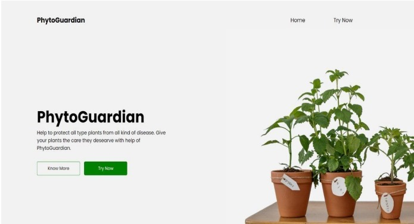
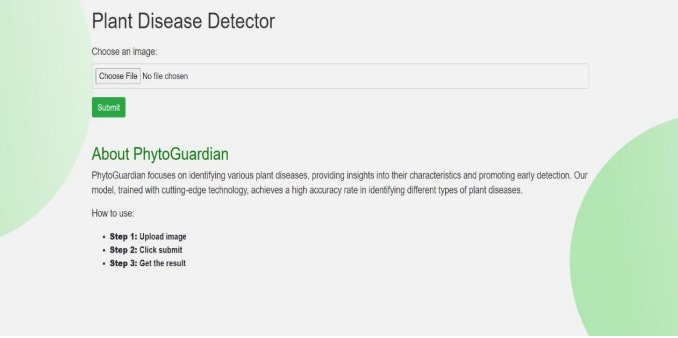
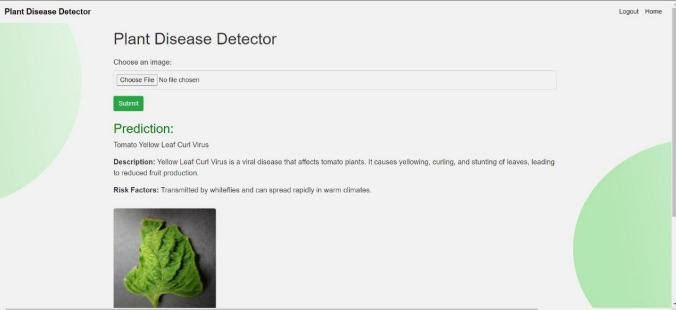

# Plant Disease Detection Website


## Overview

This repository contains the source code for a Plant Disease Detection website. The website uses machine learning models to analyze images of plants and identify the type of disease they may have. Users can upload images of their plants, and the system will provide information about the detected disease along with relevant recommendations.

## Features

- Image upload for disease detection
- Identification of plant diseases using machine learning models
- Information about detected diseases
- Recommendations for disease management

## Demo






## Getting Started

### Prerequisites

- [Python](https://www.python.org/) installed
- Install dependencies using the following command:

  ```bash
  pip install -r requirements.txt
